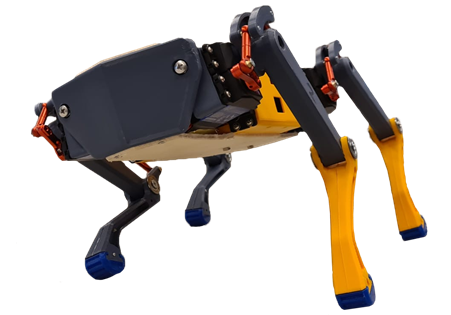

## 🤖 Spot-Redux

<!-- PROJECT SHIELDS -->
![Project Maintenance][maintenance-shield]
[![License][license-shield]](LICENSE.md)

[![Forks][forks-shield]][forks-url]
[![Stargazers][stars-shield]][stars-url]
[![Issues][issues-shield]][issues-url]

  

## About

A Quadruped robot based on the Kangal model and equipped with an ESP32 to control everything. Project during the minor in Robotics at the University of Applied Science of Leiden (Netherlands).

## Hardware

Below is a list of parts, which is divided into essential and optional parts depending on how you want to build your version of the robot.

### Essential parts

| part name           | description                          |  unit     |
|---------------------|--------------------------------------|-----------|
| ESP32 LOLIN32       | cpu                                  | 1         |
| PCA9658 module      | servo motor controller               | 1         |
| SPT5430HV-180W 8.4V | HV servo motor                       | 12        |
| DC-DC buck converter| 7V-28V to 5V 3A                      | 1         |
| 1S3P 18650 battery  | lithium ion battery                  | 2         |
| Round Rocker Switch | Switch with LED                      | 1         |

### Optional parts

| part name           | description                          |  unit     |
|---------------------|--------------------------------------|-----------|
| HX-2S-JH20          | lithium ion 2S charger               | 1         |
| WS2812 RGB LED      | RGB LED for eyes                     | 2         |
| PDC004-PD 9V        | usb-c PD decoy module                | 1         |
| STPS2045C           | power shottky rectifier              | 1         |
| battery indicator   | Lithium Battery Capacity Indicator   | 1         |

## Demo

  
  

On the left is the demo of [PingguSoft][pinggusoft-quadruped] and on the right a demo of our own. During our project we made a lot more video, you can find them in the [playlist][playlist].

## Simulation

## Bluetooth joystick control

By default, the robot connects to a few types of controllers that communicate over bluetooth, these are:

- Parrot FlyPad (Hard to get)
- [GameSirT1D][gamesir]
- Bluetooth LE joystick supported

What each button on your controller represents:

| key          |    control     |  key        |  control              |
|--------------|----------------|-------------|-----------------------|
| **A**        | walk / stop    | **L2 + L1** | step speed interval - |
| **B**        | gait change    | **L2 + R1** | step speed interval + |
| **X**        | balance mode   | **L2 + X**  | step height -         |
| **Y**        | flash ledstrip | **L2 + Y**  | step height +         |
| **THUMB - L**| save settings  | **L2 + A**  | step dist -           |
| **THUMB - R**| load settings  | **L2 + B**  | step dist +           |
| **DPAD - L** | toe offset -   | **R2 + L1** | toe offset -          |
| **DPAD - R** | toe offset +   | **R2 + R1** | toe offset +          |

## Credits

- IK model [12-DOF Quadrupedal Robot: InverseKinematics by Adham Elarabawy](https://www.adham-e.dev/pdf/IK_Model.pdf)
- [Kangal cad files](https://grabcad.com/library/diy-quadruped-robot-1) by Baris ALP
- [ESP32 QuadRuped](https://github.com/PingguSoft/esp32_quadruped) code from PingguSoft.

<!-- MARKDOWN LINKS & IMAGES -->
[maintenance-shield]: https://img.shields.io/maintenance/yes/2022.svg?style=for-the-badge
[forks-shield]: https://img.shields.io/github/forks/klaasnicolaas/Spot-Redux.svg?style=for-the-badge
[forks-url]: https://github.com/klaasnicolaas/Spot-Redux/network/members
[stars-shield]: https://img.shields.io/github/stars/klaasnicolaas/Spot-Redux.svg?style=for-the-badge
[stars-url]: https://github.com/klaasnicolaas/Spot-Redux/stargazers
[issues-shield]: https://img.shields.io/github/issues/klaasnicolaas/Spot-Redux.svg?style=for-the-badge
[issues-url]: https://github.com/klaasnicolaas/Spot-Redux/issues
[license-shield]: https://img.shields.io/github/license/klaasnicolaas/Spot-Redux.svg?style=for-the-badge

<!-- Products -->
[gamesir]: https://www.banggood.com/nl/GameSir-T1s-bluetooth-Wireless-Gaming-Controller-Gamepad-for-Android-Windows-VR-TV-Box-p-1192063.html

<!-- Links -->
[pinggusoft-quadruped]: https://github.com/PingguSoft/esp32_quadruped
[playlist]: https://www.youtube.com/playlist?list=PLuJ3dQQgpPGkJtYmtJ5d6FHydhD2ZlgSz